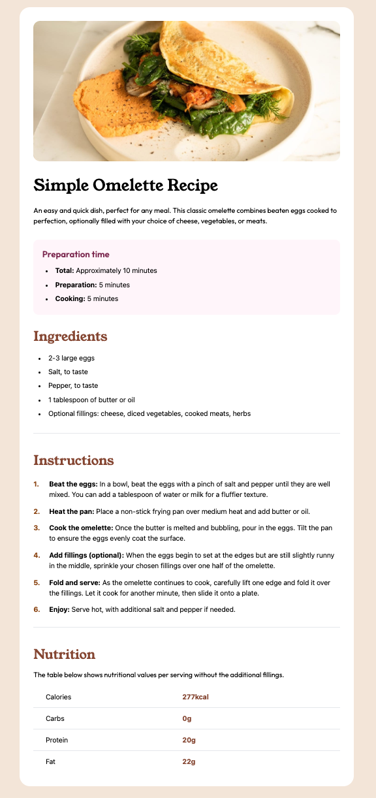

# Frontend Mentor - Recipe page solution

This is a solution to the [Recipe page challenge on Frontend Mentor](https://www.frontendmentor.io/challenges/recipe-page-KiTsR8QQKm). Frontend Mentor challenges help you improve your coding skills by building realistic projects.

## Table of contents

- [Overview](#overview)
  - [The challenge](#the-challenge)
  - [Screenshot](#screenshot)
  - [Links](#links)
- [My process](#my-process)
  - [Built with](#built-with)
  - [What I learned](#what-i-learned)
  - [Continued development](#continued-development)
- [Author](#author)

## Overview

### Screenshot

### Links

- Solution URL: [Add solution URL here](https://your-solution-url.com)
- Live Site URL: [Add live site URL here](https://your-live-site-url.com)

## My process

### Built with

- HTML
- CSS
- [React](https://reactjs.org/) - JS library
- [Tailwind CSS](https://tailwindcss.com/) - For styles

### What I learned

I improved my Tailwind CSS skillset. I'm still learning how to create responsive websites that are both mobile and desktop friendly.

I learned how to use HTML tables.

### Continued development

- I want to continue learning how to create responsive websites that are both mobile and desktop friendly.

## Author

- Website - [Justin Levy](https://justlevy.com)
- Frontend Mentor - [@justinsane](https://www.frontendmentor.io/profile/justinsane)
- Twitter - [@just_levy](https://www.twitter.com/just_levy)
